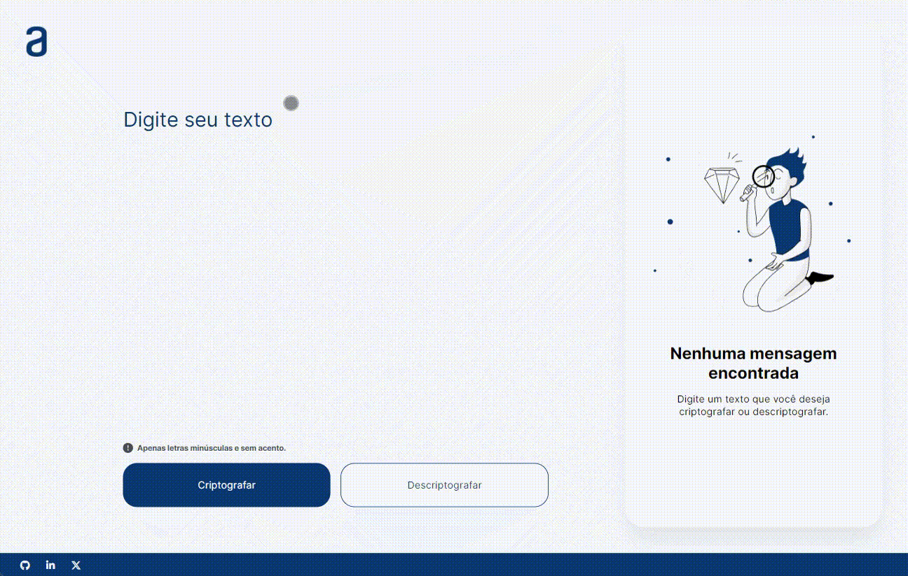

# Encriptador e descriptador de textos

Este projeto permite aos usuários criptografar e descriptografar textos de acordo com o texto fornecido.

## Demonstração

### Link do projeto

[Criptografador e descriptografador de textos](https://bsandes.github.io/challenge-one-decodificador/)

## Stack utilizadas

- HTML
- CSS
- JavaScript

## Aprendizados

- Exercitei minhas habilidades em HTML, aplicando boas práticas para acessibilidade e estrutura semântica, visando uma melhor indexação nos sistemas de busca (SEO).
- Implementei um design responsivo com CSS, utilizando flexbox e unidades de medidas relativas para assegurar a adaptabilidade do layout em diversas resoluções de tela.
- Aprimorei minhas habilidades de programação com JavaScript, utilizando manipulação do DOM, funções e estruturas condicionais.

## Autores

Este projeto foi desenvolvido como parte de um desafio do **Programa ONE - Oracle Next Education**, uma iniciativa da **Oracle** em parceria com a **Alura**. Além de abordar conceitos de lógica de programação com JavaScript, o curso também inclui temas sobre desenvolvimento pessoal.

Saiba mais sobre o [Programa ONE - Oracle Next Education](https://www.oracle.com/br/education/oracle-next-education/)

## Referência

- [Template do Figma](https://www.figma.com/file/tvFEYhVfZTjdJ5P24RGV21/Alura-Challenge---Desafio-1---L%C3%B3gica?type=design&node-id=10-165&mode=design&t=Y9vsl1J8XFmO8Cwu-0)